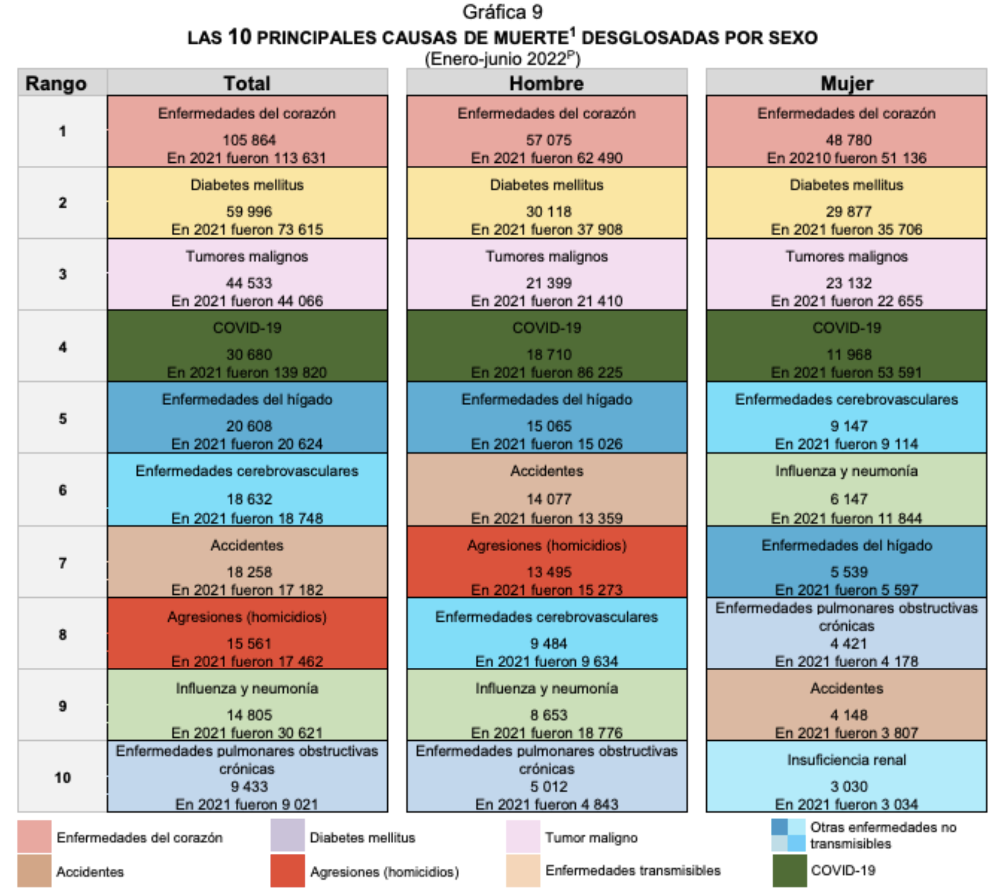
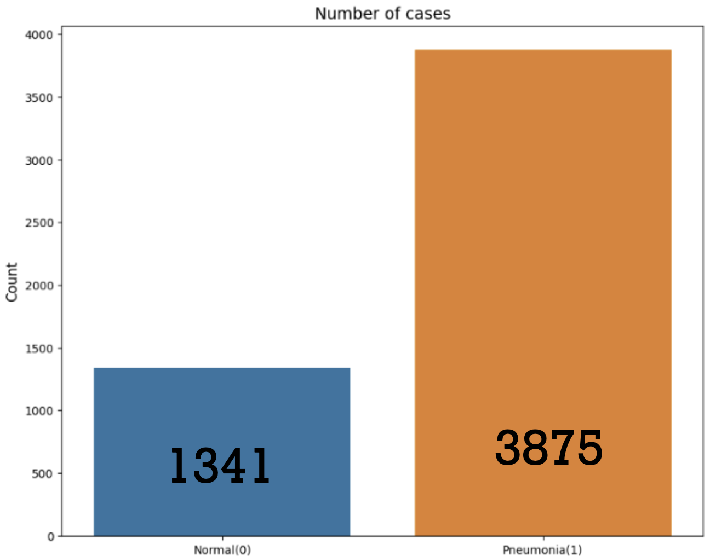
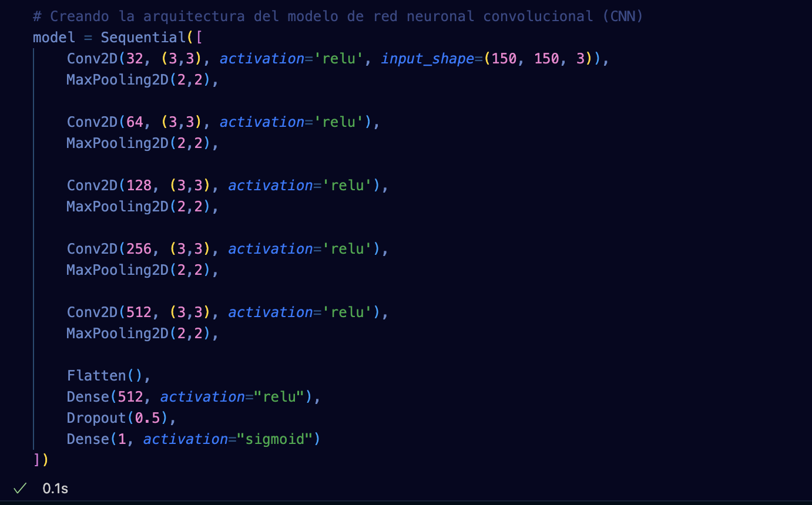
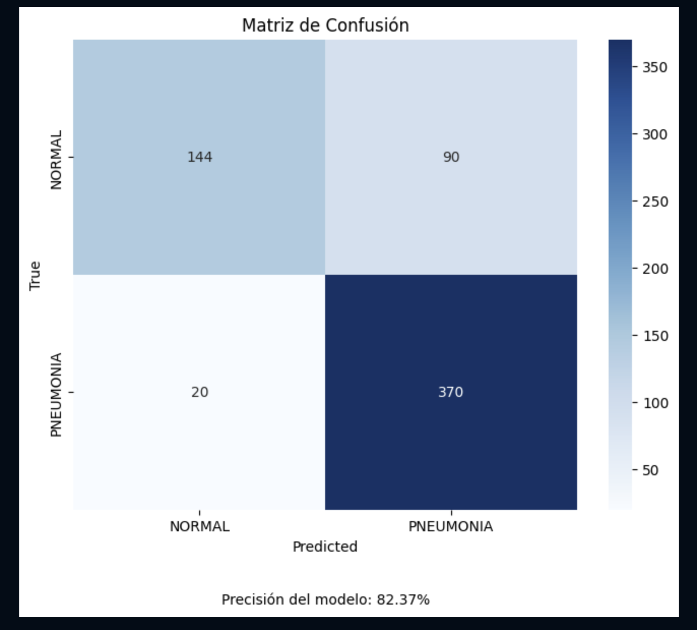
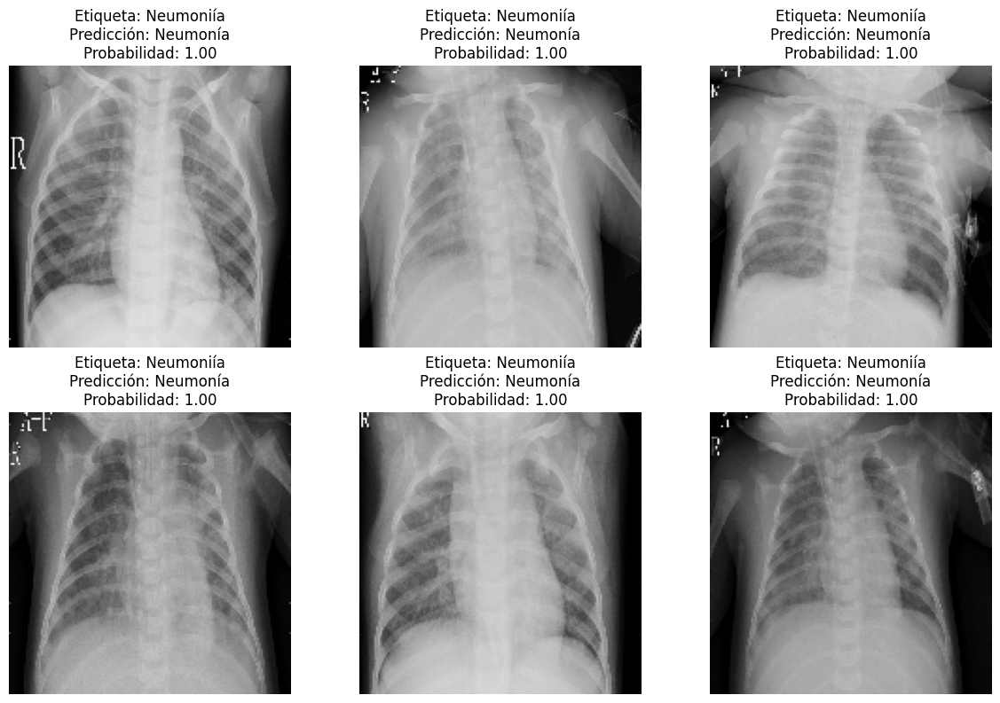
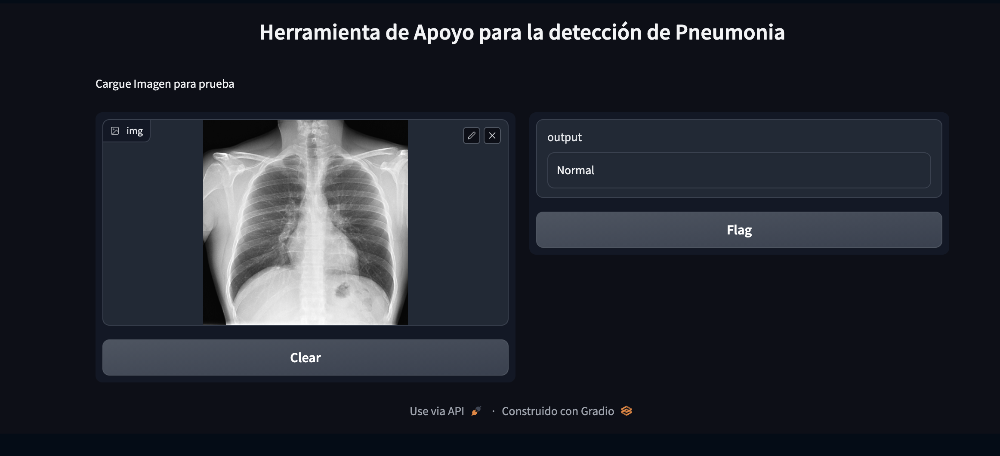

# Proyecto 7

Proyecto de deteccion de neumonia con modelado de inteligencia artificial. 

##Introducción

Las herramientas que hoy dia nos ofrece la tecnologia abren el campo de las opciones que se ofrecen en el dia a dia, uno de los campos en los que 
dicho impacto puede verse reflejado es el campo de la medicina. 
El tratameinto de diversas enfermedades depende ampliamente del analisis de especialistas calificados a los que, por desgracia, un buen porcentaje de la 
población no puede acceder. Es en estos casos donde la tecnologia puede ofrecer ayuda no solo para los pacientes, tambien para un sistema de salud que se encuentra saturado y en busca de opciones que pueda ayudar al flujo de pacientes y su tratamiento. 

La neumonia es una de las afecciones de salud que mas repercuten en la población mexicana actualmente. Según sifras del INEGI las afecciones respiratorias se encuentran entre las primeras 10 causas de muerte con respecto a los ultimos 3 años. Como la mayoria de las afecciones de salud la pronta deteccion y tratamiento influyen directamente en el pronostico del avance de dicha enfermedad, por lo tanto este proyecto pretende otorgar una alternativa para ayudar a la rapida deteccion de la patologia. 

##Dataset

Para el entrenamiento de nuestro modelo utilizamos una base de datos publica extraida de la pagina Kaggle. Dicha base de datos cuenta con tres apartados de imagenes, dividiendose a su vez en dos categorias: "Normal" y "Pneumonia".

Una vez se realiza el analisis exploratorio de la base de datos podemos anticipar el obvio desvalance del feed de datos, por lo que esto sera tomado en cuenta en la interpretaciòn de los datos. 

##Entrenamiento

Para este modelo se utilizara el tratamiento de imagenes del modulo Keras de la paqueteria TensorFlow, constryendo una red neuronal de 5 capas de procesameinto y una de salida y adecuacion, evaluacion estandar con 5 epocas (cantidad de epocas elegida por resltados exploratorios de una serie de pruebas). 

Una vez construido el modelo tenemos los siguientes resultados de prediccion, junto con sus marcadores estadisticos:

Segun los resultados de nuestro modelo podemos consideres que el porcentaje de accuracy se encuentra en 83%, numero que si bien no es bajo tambien ofrece un panorama para la mejora de dicho modelado devido a que el campo de trabajo es la salud. 

Una de las areas de oportunidad con una repercusion mayor es el inbalance de las muestras y tambien la poca variacion de estas, ya que un variedad de opciones podrian hacer a nuestro modelo aun mas especifico y por lo tanto mas seguro, por otro lado un procesamiento mucho mas especifico de las imagenes podria ayudar tambien a mejorar el modelo. 

##Implementacón

Se diseño una interfaz ejecutable para que el modelo pueda ser porbado con imagenes externas. 

Este proyecto sienta una base para demostrar el impacto que se puede añcanar con un desarrollo de herrameintas alimentadas con el procesamiento de datos y la inteligencia artificali en aspectos tan variados como ayudar al campo de salud en general. 
